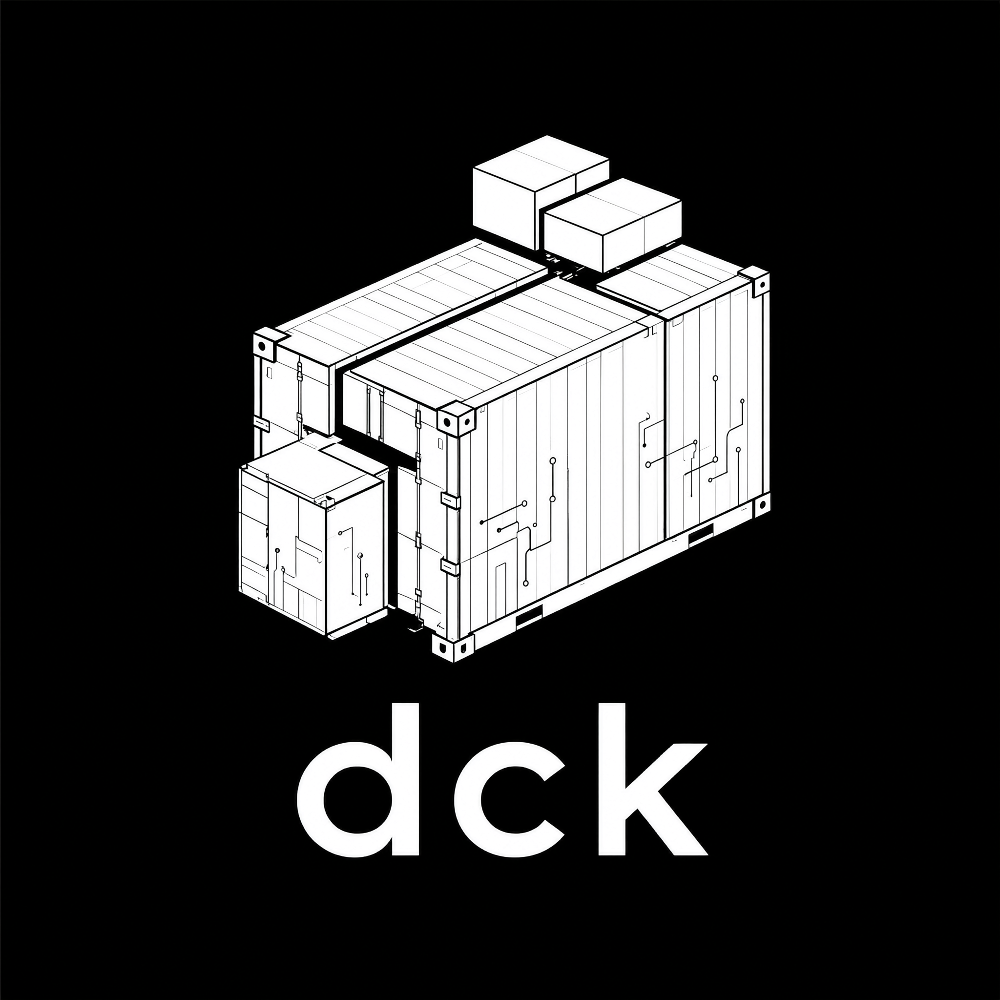

<!-- dck-version:start -->
**Documentation version:** `1.25.2`
**Project release:** `v1.25.2`
<!-- dck-version:end -->

<p align="center">
  
</p>

> Version markers are generated from the root `VERSION` file. Run `make docs` to update all Markdown files, or `make docs-check` in CI to verify synchronization.

# dck Documentation

**dck** — ~5 MB static binary, zero daemon. Drop-in container runtime for Linux.

```
dck pull alpine               dck pull nginx:alpine
dck run -d -p 80:80 nginx     dck run -i -t --rm alpine sh
dck up                        dck cluster init
dck serve                     dck fn deploy --name hello myfunc
```

Version: see the root [`VERSION`](../VERSION) file — [GitHub](https://github.com/animesao/dck)

## Start here

- [Complete CLI command reference (English)](en/commands.md)
- [Полный справочник CLI (русский)](ru/commands.md)
- [Command examples (English)](en/examples.md)
- [Примеры команд (русский)](ru/examples.md)
- [Contributing guide](../CONTRIBUTING.md)
- [Security model and vulnerability reporting](../SECURITY.md)
- [Running guide (English)](en/running.md)
- [Руководство по запуску (русский)](ru/running.md)

The running guides cover installation, image/tag syntax, bind mounts, `.env`, Python bots, Java/Minecraft servers, logs, restart policies, automatic backups, updates, and troubleshooting. The build guide documents local checks, cross-compilation, CI matrix behavior, and release automation.

## CLI Command Reference

### Image Management
| Command | Description |
|---------|-------------|
| `dck pull <image>[:tag]` | Pull image from registry |
| `dck push <image>[:tag]` | Push image to registry |
| `dck images` | List local images |
| `dck search <term>` | Search Docker Hub |
| `dck rmi <image>[:tag]` | Remove image |
| `dck verify <image>[:tag]` | Verify image config and layer digests |
| `dck commit <container> <image>[:tag]` | Create image from container |
| `dck build -t name:tag .` | Build from Dockerfile |
| `dck export <image> -o file.tar.gz` | Save image to file |
| `dck import <file.tar.gz>` | Load image from file |
| `dck login <registry>` | Log in to registry |
| `dck logout <registry>` | Log out |

### Container Lifecycle
| Command | Description |
|---------|-------------|
| `dck run [opts] <image> [cmd]` | Create and run container |
| `dck start <container>` | Start stopped container |
| `dck stop <container>` | Stop running container |
| `dck restart <container>` | Restart container |
| `dck rm [-f] <container>` | Remove container |
| `dck rename <c> <new-name>` | Rename container |
| `dck set <c> [opts]` | Change container params |
| `dck ps [-a]` | List containers |
| `dck backup create/list/restore/enable/disable/status/verify` | Manual and scheduled container backups |
| `dck init` | Internal container init |

### Monitoring & Logs
| Command | Description |
|---------|-------------|
| `dck logs [-f] [--tail <n>] <c>` | Show/follow/tail logs |
| `dck stats [container] [--no-stream]` | CPU, RAM, IO stats (live or one-shot) |
| `dck top <container>` | Running processes |
| `dck info` | System-wide info |
| `dck doctor [--strict]` | Read-only host/runtime diagnostics |
| `dck security check [--strict]` | Security-focused diagnostics |
| `dck events` | Stream container events |

### Network
| Command | Description |
|---------|-------------|
| `dck port <container>` | Show port mappings |
| `dck port add <c> H:C[/p]` | Add port mapping (hot) |
| `dck port rm <c> H[/p]` | Remove port mapping (hot) |

### Filesystem
| Command | Description |
|---------|-------------|
| `dck fs ls <c> [path]` | List files |
| `dck fs cat <c> <path>` | Show file content |
| `dck fs tree <c> [path]` | Directory tree |
| `dck fs find [c] [path] [opts]` | Find files |
| `dck cp <src> <dst>` | Copy files host↔container |

### Execution
| Command | Description |
|---------|-------------|
| `dck exec <c> <cmd>` | Run command in container |
| `dck console <c>` | Web terminal |
| `dck console-serve` | Console server (internal) |
| `dck attach <c>` | Attach to main process |

### Compose
| Command | Description |
|---------|-------------|
| `dck up [-f config] [service]` | Start containers from config |
| `dck up --generate` | Generate config from existing containers |
| `dck down [-f config] [-a] [service]` | Stop/remove from config |

### Volumes
| Command | Description |
|---------|-------------|
| `dck volume create <name>` | Create named volume |
| `dck volume ls` | List volumes |
| `dck volume rm <name>` | Remove volume |
| `dck volume inspect <name>` | Inspect volume |
| `dck volume prune` | Remove unused volumes |

### Cluster
| Command | Description |
|---------|-------------|
| `dck cluster init [--serve]` | Initialize cluster |
| `dck cluster join <peer> [--serve]` | Join cluster |
| `dck cluster join-token` | Show peer address |
| `dck cluster leave` | Leave cluster |
| `dck cluster info` | Cluster overview |
| `dck cluster ls` | List cluster nodes |
| `dck cluster node ls` | List nodes with resources |
| `dck cluster node inspect <id>` | Node details |
| `dck cluster serve [-p 2375]` | API server for replicas |

### Services
| Command | Description |
|---------|-------------|
| `dck service create ...` | Create replicated service |
| `dck service ls` | List services |
| `dck service rm <name>` | Remove service |
| `dck service scale <name> N` | Scale service |
| `dck service update <name>` | Rolling update |

### FaaS (Functions)
| Command | Description |
|---------|-------------|
| `dck fn deploy [--name <n>] <file>` | Deploy serverless function |
| `dck fn ls` | List functions |
| `dck fn rm <name>` | Remove function |
| `dck fn call <name>` | Invoke function |

### Blueprints
| Command | Description |
|---------|-------------|
| `dck blueprint list` | List available blueprints |
| `dck blueprint info <name>` | Show blueprint details |
| `dck blueprint install <name>` | Install a blueprint |
| `dck blueprint repo add <url>` | Add repository |
| `dck blueprint repo list` | List repositories |
| `dck blueprint repo remove` | Remove repository |

### System
| Command | Description |
|---------|-------------|
| `dck serve [-p 2375] [-H host] [-d] [--token <key>]` | Start REST API server (localhost by default; external bind requires Bearer token) |
| `dck serve --tls-cert cert.pem --tls-key key.pem` | Serve the API over HTTPS |
| `dck system prune` | Clean up unused resources |
| `dck update [--check]` | Self-update |
| `dck bootstrap [--install\|--remove]` | Install/start or remove the systemd supervisor |
| `dck version / --version / -v` | Show version |
| `dck help / --help / -h` | Show help |

## Run Options

| Flag | Description |
|------|-------------|
| `-d` | Detach (background) |
| `-n <name>` | Container name |
| `-p H:C[/p]` | Port mapping |
| `--ports H:C` | Port mapping (alias) |
| `-v S:D` | Volume mount |
| `--volume / --vol S:D` | Volume mount (alias) |
| `-e K=V` | Environment variable |
| `--env-file <f>` | Env from file (one per line, `KEY=VAL` or `export KEY=VAL`) |
| `-i` | Interactive (keep stdin) |
| `-t` | Allocate TTY |
| `--rm` | Auto-remove on exit |
| `--restart <policy>` | `no`, `always`, `on-failure`, `unless-stopped`; detached boot supervision applies to `always`/`unless-stopped` |
| `--restart-max-attempts <n>` | Crash-loop budget before automatic restart is blocked |
| `--restart-window <duration>` | Window used for the crash-loop budget |
| `--restart-delay <duration>` | Wait before automatic restart, e.g. `10s`, `1m` |
| `--memory / --ram <lim>` | Memory limit (e.g. `1g`, `512m`) |
| `--cpus / --cpu <num>` | CPU limit (e.g. `1.5`, `4`) |
| `--disk <lim>` | Disk limit (e.g. `10G`) |
| `--workdir <dir>` | Working directory |
| `-h <name>` | Container hostname |
| `--entrypoint <cmd>` | Override entrypoint |
| `--image ` | Image (instead of positional) |
| `--cmd / --command <cmd>` | Command (instead of positional) |
| `--cap-add / --cap-drop` | Linux capabilities |
| `--user <uid>` | UID or UID:GID |
| `--readonly` | Read-only rootfs |
| `--no-new-privs` | Explicitly request no-new-privileges (dck also enforces this security default) |
| `--sysctl <k=v>` | Sysctl options |
| `--ulimit <opt>` | Ulimit options |
| `-l / --label <k=v>` | Container labels |
| `--dns <ip>` | DNS server |
| `--network <mode>` | `bridge`, `none`, `host` |
| `--startup <s>` | Startup script (inline or `@file`) |
| `--healthcheck-cmd <cmd>` | Health check command |
| `--healthcheck-interval <s>` | Interval (seconds) |
| `--healthcheck-retries <n>` | Retries |
| `--healthcheck-timeout <s>` | Timeout (seconds) |

## Docs Index

| English | Русский |
|---------|---------|
| [Running Guide](en/running.md) | [Руководство по запуску](ru/running.md) |
| [Complete CLI Reference](en/commands.md) | [Полный справочник CLI](ru/commands.md) |
| [Command Examples](en/examples.md) | [Примеры команд](ru/examples.md) |
| [Usage & Commands](en/usage.md) | [Команды и использование](ru/usage.md) |
| [Deploying Websites](en/websites.md) | [Развёртывание сайтов](ru/websites.md) |
| [Bots (Telegram, Discord)](en/bots.md) | [Боты (Telegram, Discord)](ru/bots.md) |
| [Compose / Deployment](en/compose.md) | [Compose / Развёртывание](ru/compose.md) |
| [Compose Examples (15 configs)](en/compose-examples.md) | [Примеры Compose (15 конфигураций)](ru/compose-examples.md) |
| [Cluster Orchestration](en/cluster.md) | [Кластерная оркестрация](ru/cluster.md) |
| [FaaS / Serverless](en/faas.md) | [FaaS / Serverless](ru/faas.md) |
| [Build, CI & Versioning](build.md) | [Сборка, CI и версионирование](build.md) |

## Architecture

```
Storage: `$DCK_DATA_DIR` (default: `/root/.dck/`)

images/        OCI rootfs per tag
containers/    State JSON files
overlay/       upper/work/merged per container
logs/          Container stdout/stderr (fresh on each new start)
volumes/       Named volumes
cache/         Cached image layers
consoles/      Unix sockets for attach

dck run -d
  ├─ unshare --fork --pid --mount --net --uts --ipc dck init <id>
  │   └─ dck init → pivot_root to overlay → setup /proc/lo/eth0 → exec CMD
  └─ dck console-serve <id>
      ├─ reads stdout pipe
      ├─ writes to log file
      ├─ listens on Unix socket
      └─ broadcasts to all attach clients
```

## Quick Reference

```bash
dck pull nginx:alpine            # Pull image
dck run -d -n web -p 80:80 nginx # Detached web server
dck run -i -t alpine sh          # Interactive shell
dck ps                           # List running containers
dck logs web                     # View logs
dck stop web                     # Stop container
dck rm web                       # Remove container
dck up                           # Start from dck.toml
dck cluster init                 # Init cluster
dck fn deploy --name hello fn.py # Deploy function
```
